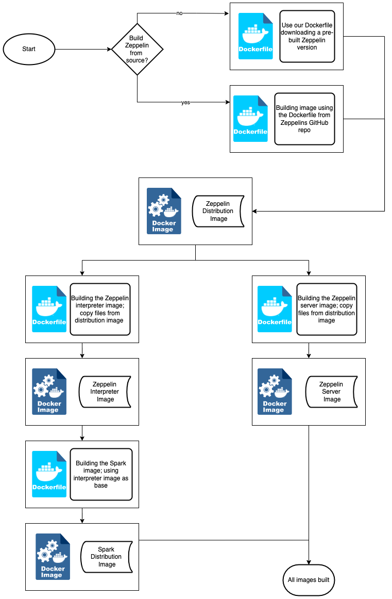
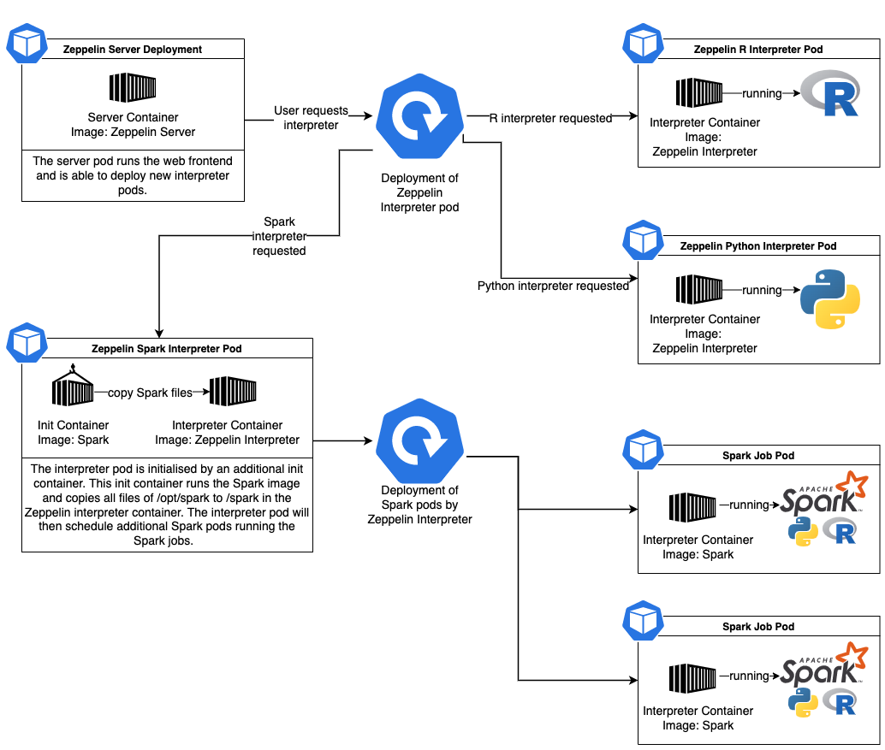

# Building Zeppelin and Spark with S3 support for Kubernetes
This repository includes the necessary files and instructions to build and
run Apache Zeppelin in Kubernetes. In addition we will also create a
Apache Spark distribution that supports S3 storage.
You can read the full story on [this](ToDo) medium article.

# Build images with script (easiest option)
This git includes two scripts to build all images in the right order.
It is possible to change the Zeppelin and Spark and Hadoop versions in the script.
Furthermore, you can use those scripts as templates for your own build pipelines.

## build_from_binary.sh
This script will download a binary distribution of Zeppelin to create
the Zeppelin distribution image.
Please check the Zeppelin (and Spark) download page for valid options.
The default configuration of this script will build Zeppelin version 0.10.0

## build_from_source.sh
This script will download Zeppelin from the official git and checkout a
configured commit. Then it will start to compile Apache Zeppelin from source.
This is useful if you want to use a certain version of Zeppelin.
Please note, that you have to add -SNAPSHOT (in capital letters) to the
Zeppelin version.
The default configuration will build a snapshot of Zeppelin 0.11.0.

# Manual execution of build steps
If you want to build all images by yourself, you can follow the instructions
in this part of the Readme.

## Zeppelin Distribution
First, we will create the distribution image which is a complete build of Zeppelin and all available interpreters. Parts of this distribution will be used in the following image builds.

There are three options to get a Zeppelin Distribution as base image.

### Use an official build
You can use the images from https://hub.docker.com/r/apache/zeppelin/tags as
base image in the following Dockerfiles.
Please note, that you have to tag this image accordingly (another option is to change the FROM section in the Dockerfiles). 

### Build an image with a binary distribution
If you want to build your own image based on a release from the Apache Zeppelin
website, you can use [this Dockerfile](zeppelin-distribution-binary/). This makes sense when you want to exclude
certain interpreters or modify parts of the distribution.

### Build Zeppelin from source
When you want to use the newest version (e.g. to use newer Spark releases) or a
certain release from the git, you have to build Zeppelin from source.
Please follow the instructions [here](zeppelin-distribution-source/).

## Zeppelin Server Image
The server image is used to start the spark server itself.
You can find the detailed instructions in [zeppelin-server](zeppelin-server/)

## Zeppelin Interpreter Image
The Zeppelin interpreter image will be used to interpret the content of your notebooks. That means R, Python or Spark will be run by executing this image.
All required files can be found at [zeppelin-interpreter](zeppelin-interpreter/)

## Spark Image
This image will be executed by the Zeppelin interpreter to run your Spark jobs. That means your Spark notebooks are interpreted by the Zeppelin interpreter container but executed in separated Spark containers.
You can find the Dockerfile to build Spark with S3 support [here](spark/).

# Kubernetes Deployment

You can find an example deployment file in [deployment](deployment/).
