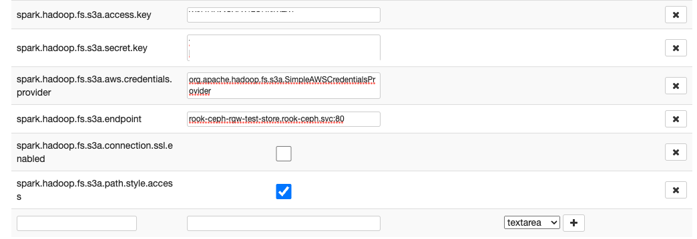

# S3 configuration parameters for Spark interpreter
You have to configure those parameters to use S3 support in Zeppelins
Spark.

| Parameter | Description | Type |
|---|---|---|
| spark.hadoop.fs.s3a.access.key | The access key of your user. | textarea |
| spark.hadoop.fs.s3a.secret.key | The secret key of your user. | textarea |
| spark.hadoop.fs.s3a.endpoint | The hostname/IP of your S3 server. | textarea |
| spark.hadoop.fs.s3a.aws.credentials.provider | The credential provider for your connection. For simple authentication with secret and access key use: org.apache.hadoop.fs.s3a.SimpleAWSCredentialsProvider | textarea |
| spark.hadoop.fs.s3a.path.style.access | Sets if path style access is supported by the S3 server. Should be activated in general. | textarea with true/false or Checkbox |
| spark.hadoop.fs.s3a.connection.ssl.enabled | Wether your connection uses SSL or not. | textarea with true/false or Checkbox |

